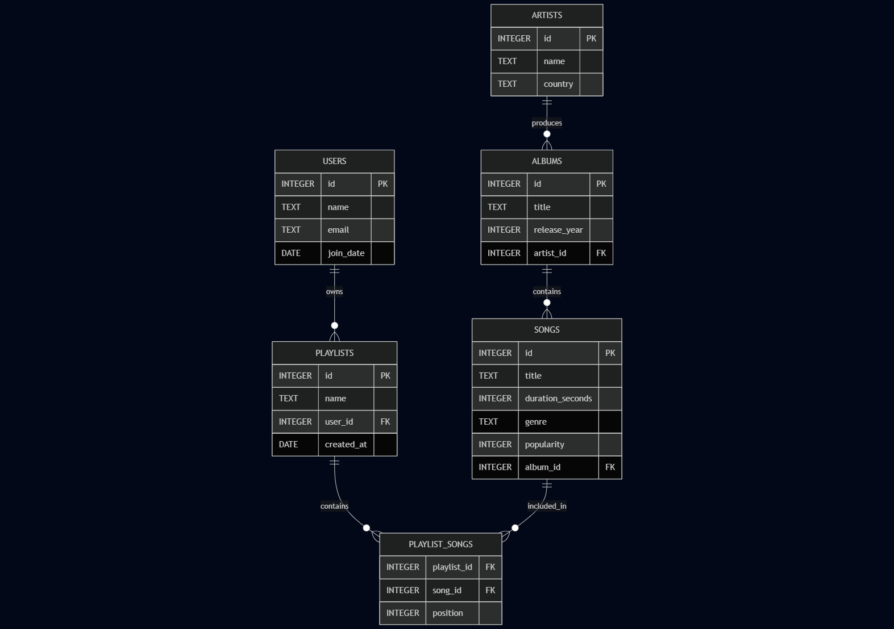

# Music Streaming Database

By João Pedro

Video overview: <https://www.youtube.com/watch?v=keU7UcZ_q4c>

## Scope

* What is the purpose of your database?
The purpose of this database is to manage information related to songs, artists, albums, playlists, and users, simulating a music streaming platform. It allows storing, organizing, and querying musical data and user-created playlists.

* Which people, places, things, etc. are you including in the scope of your database?
The scope includes users, artists, albums, songs, playlists, and the relationships between these entities, such as which songs belong to which albums and which playlists contain which songs.

* Which people, places, things, etc. are *outside* the scope of your database?
The database does not cover real-time playback, user authentication, social interactions, copyright management, or detailed listening statistics.

## Functional Requirements

* What should a user be able to do with your database?
Users should be able to create and manage playlists, add or remove songs, search for songs by artist, album, or genre, and retrieve detailed information about songs, albums, artists, and playlists.

* What's beyond the scope of what a user should be able to do with your database?
The system does not support music playback, multi-user authentication, or complex social features such as messaging or following other users.

## Representation

### Entities

* Which entities will you choose to represent in your database?
Users, Artists, Albums, Songs, Playlists, and the associative entity Playlist_Songs.

* What attributes will those entities have?
- User: id (integer, primary key), name (text), email (text), join_date (date)
- Artist: id (integer, primary key), name (text), country (text)
- Album: id (integer, primary key), title (text), release_year (integer), artist_id (foreign key)
- Song: id (integer, primary key), title (text), duration_seconds (integer), genre (text), popularity (integer), album_id (foreign key)
- Playlist: id (integer, primary key), name (text), user_id (foreign key), created_at (date)
- Playlist_Songs: playlist_id (foreign key), song_id (foreign key), position (integer)

* Why did you choose the types you did?
The data types were chosen for simplicity, clarity, and efficiency. Integers are used for IDs and numeric values like duration and popularity, text for names and titles, and date types for timestamps to enable date-based queries.

* Why did you choose the constraints you did?
Primary keys uniquely identify records, foreign keys maintain referential integrity, and composite keys in Playlist_Songs ensure no duplicate song entries per playlist. ON DELETE CASCADE is used to maintain data consistency when parent records are deleted.

### Relationships

The diagram above represents the entities and their relationships in the music database.

- **Users (USERS)** can create multiple playlists (PLAYLISTS), establishing a one-to-many (1:N) relationship. Each playlist belongs to a single user, but a user can have multiple playlists.

- **Artists (ARTISTS)** produce multiple albums (ALBUMS), also a one-to-many (1:N) relationship. Each album is associated with a single artist, but an artist can have multiple albums.

- Each **album (ALBUMS)** contains multiple songs (SONGS), another one-to-many (1:N) relationship. Each song belongs to an album, while an album can contain many songs.

- **Playlists (PLAYLISTS)** and **songs (SONGS)** have a many-to-many (N:N) relationship, since a playlist can contain multiple songs, and a song can be in multiple different playlists. To model this relationship, we use an associative table called **playlist_songs**, which contains foreign keys referencing both playlists and songs, as well as the position of the song within the playlist.

## Optimizations

* Which optimizations (e.g., indexes, views) did you create? Why?
To improve performance and ensure efficient data retrieval, several optimizations were implemented:

- **Indexes:** We created indexes on foreign key columns such as `artist_id` in the `albums` table, `album_id` in the `songs` table, and both `playlist_id` and `song_id` in the `playlist_songs` table. These indexes speed up join operations that are frequent in queries involving multiple tables, reducing query execution time significantly.

- **Views:** To simplify complex queries and improve maintainability, we created several views. For example, the `song_details` view aggregates information from songs, albums, and artists, allowing users to query detailed song data without writing complex joins repeatedly. Another view, `artist_popularity`, calculates the average popularity of songs per artist, enabling quick analysis of artist performance. Similarly, `album_duration` sums the total duration of songs per album, useful for playlist and album length summaries.

- **CTEs (Common Table Expressions):** We use CTEs in analytical queries to improve readability and modularity. For instance, calculating average popularity per artist is structured as a CTE, making the SQL easier to understand and maintain.

- **Constraints:** Primary and foreign key constraints enforce data integrity and consistency across the database. The composite primary key in the `playlist_songs` table prevents duplicate song entries in the same playlist, preserving data correctness.

These optimizations collectively ensure that the database performs efficiently even with complex queries, and make the system easier to extend and maintain.

## Limitations

* What are the limitations of your design?
Despite its robustness, the database has some inherent limitations:

- It does not support real-time streaming data or track detailed user listening behavior, limiting its use for applications requiring live analytics or personalized recommendations based on listening history.

- User authentication and security features are not implemented, which are essential for real-world applications but outside the scope of this educational project.

- The model assumes a single artist per album and does not support multiple artists collaborating on the same song or album, which is common in many music productions.

- Collaborative playlists, where multiple users can contribute songs, are not supported.

- Social features such as following users, messaging, or sharing playlists are also outside the scope.

* What might your database not be able to represent very well?
The database focuses on static metadata and playlist management, which means it may not represent:

- Complex musical collaborations involving multiple artists on the same track.

- Different versions or editions of songs and albums (e.g., remastered, live versions).

- Detailed user activity logs, such as playback history or interaction timestamps, which would require additional tables and a different design approach.

- Dynamic, real-time data related to music playback or streaming analytics.

These limitations reflect conscious design choices prioritizing simplicity and clarity suitable for learning SQL concepts and relational database design fundamentals.
